In this step, you will visualize the data from your MySQL database.

Switch to the `Grafana (Podman)` tab of the lab environment.

First, Click the menu button in the upper-left of Grafana, and then click `Dashboards`.

Next, click `New` then click `New Dashboard`.

Click on `Add Visualization`
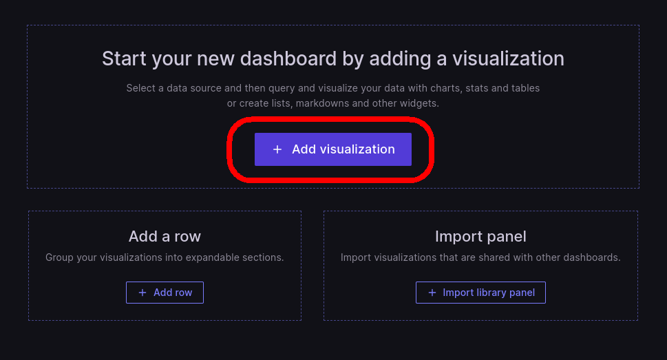

Select MySQL as your data source.
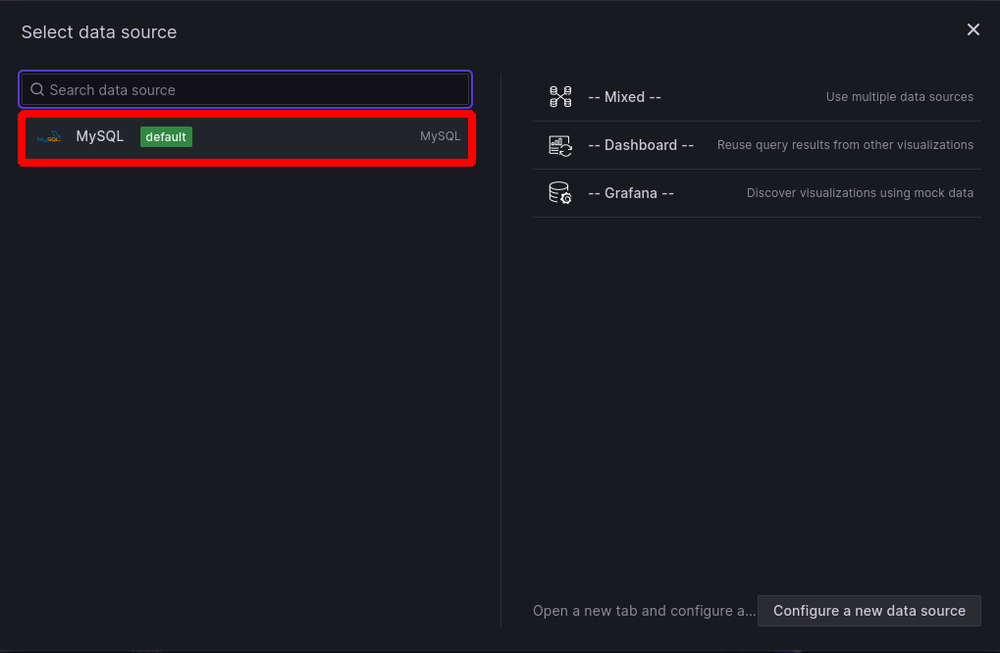

You will now see a blank dashboard editor.
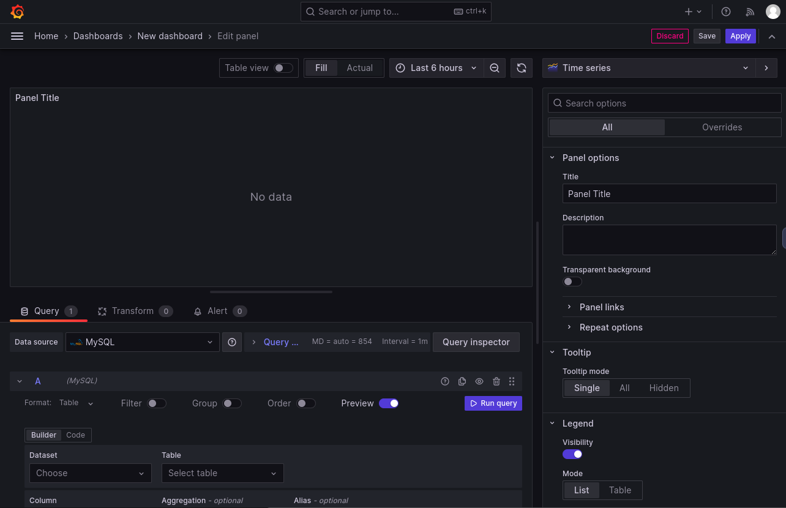

In the query section, select the following options:
* Format: `Table`
* Filter: Disabled
* Group: Disabled
* Order: Disabled
* Preview: Enabled
* Dataset: `Population`
* Table: `Singapore_Population`
* Column: `*`

After you have entered the configuration listed above, the query editor box should look like this:
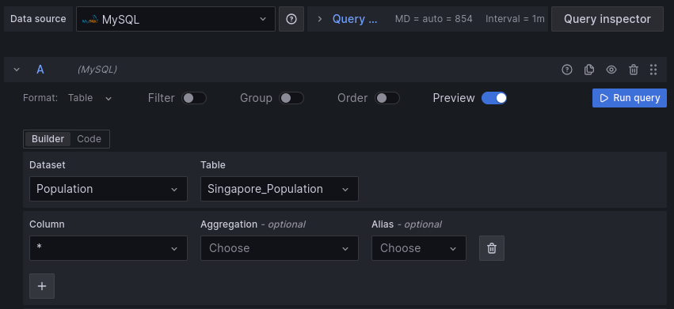

Here is what that configuration means:
* The format is set to `Table` because our SQL data is formatted as a table.
* `Population` is the name of the MySQL database you are accessing
* Within the `Population` database, you are importing data from a table called `Singapore_Population`
* The `*` selection for column indicates that you are importing all columns.
* The Aggregation and Alias sections can be left blank as we are not transforming our data in this lab.

After selecting the query options, click `Run query` and then click `Zoom to data`.
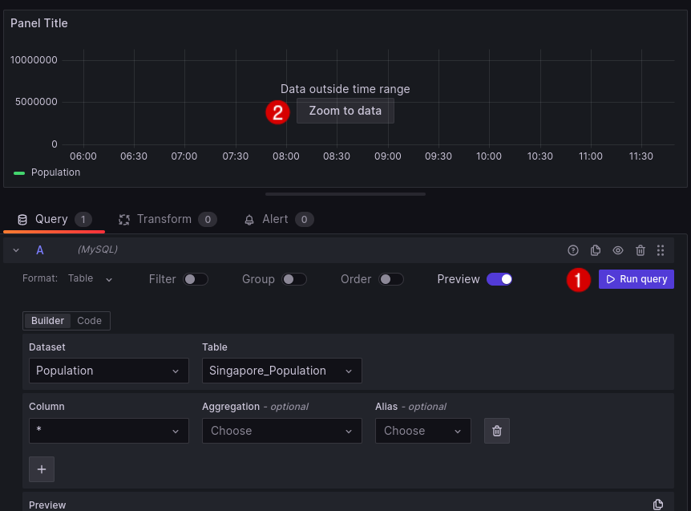

You will now see a graph of Singapore's population from 1972-2022.

However, our database contains data from 1950-2022, so we want Grafana to query all of the data, not just the first 50 entries. To edit your SQL query, click on `Code` in your query configuration options:
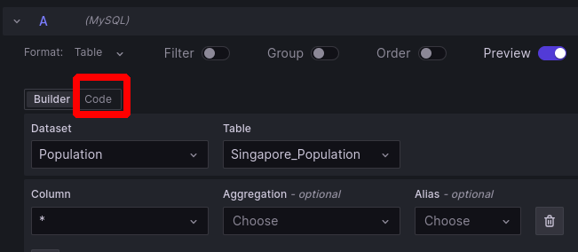

From the code editor, remove the part that says  `LIMIT 50`, and then click on `Run query`
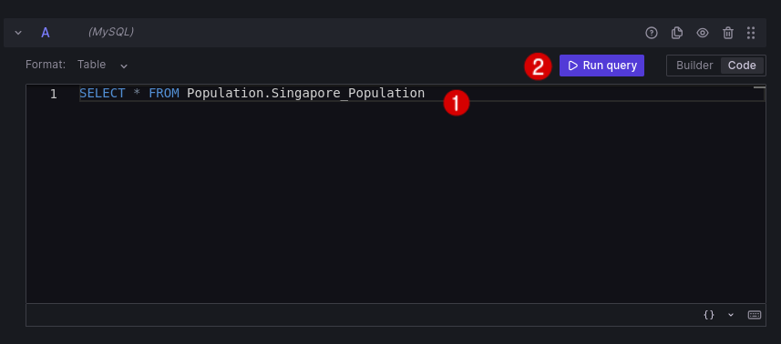

Now Grafana is querying all of our data, but there is still one problem. We need to adjust the scale of our graph so we can see the output. Click `Change time settings` and select `Coordinated Universal Time` from the drop-down box. Next, click on the time range above the graph and enter the following settings for the absolute time range:
* From: `1950-01-01 00:00:00`
* To: `2022-01-01 00:00:00`

Then click `Apply time range` to apply your selections.
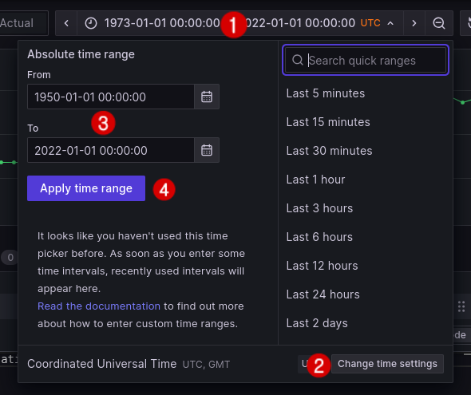

Now, you will see all of your data in the graph.
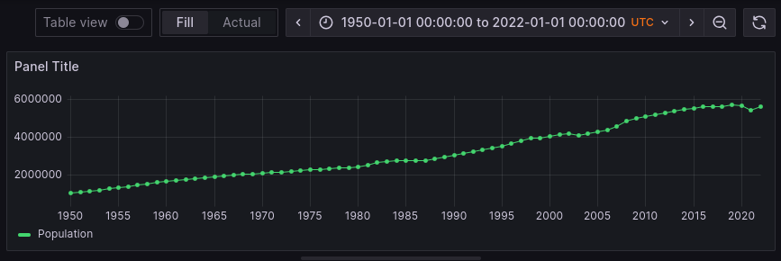

Enter a title for your graph and then click `Save` to save your graph.
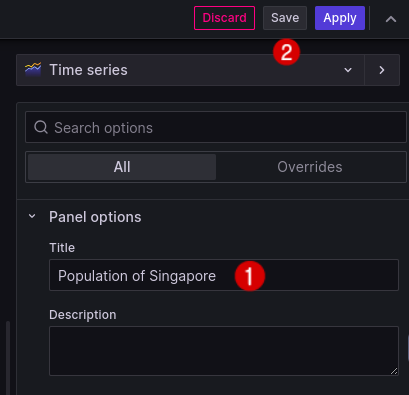

Finally, when prompted, enter a name for your dashboard and click `Save`.
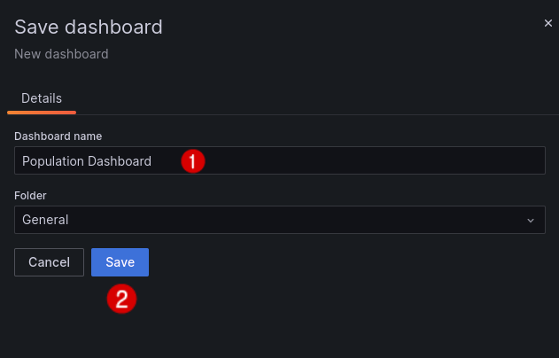

You will now see your data dashboard!
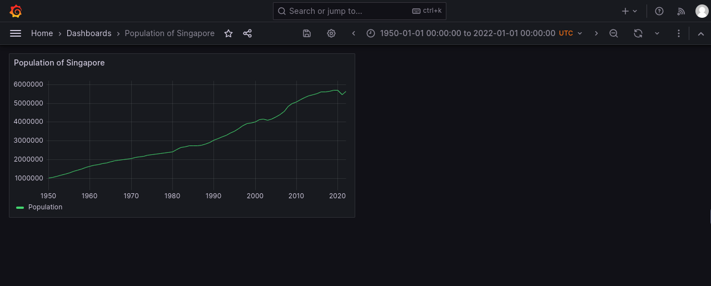
