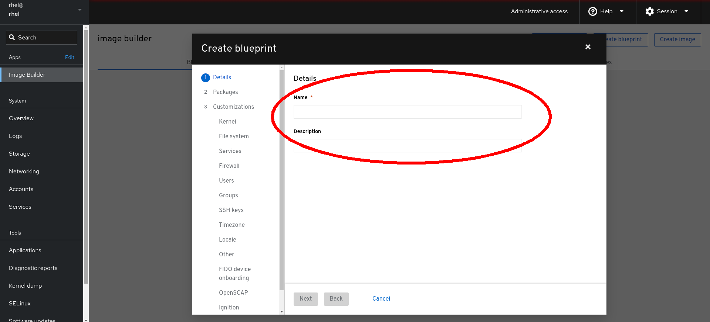
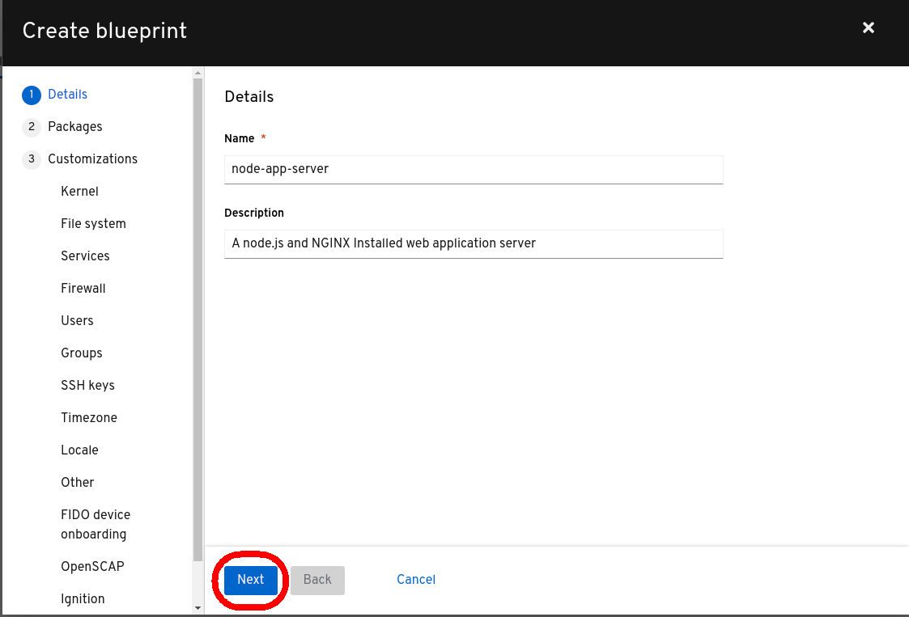
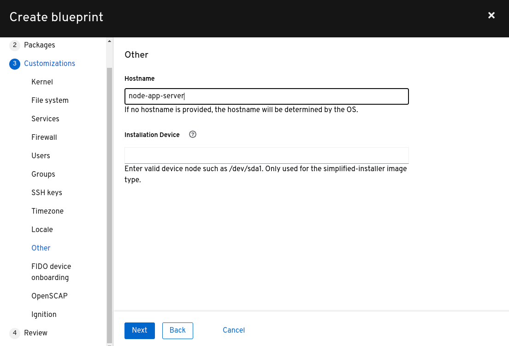
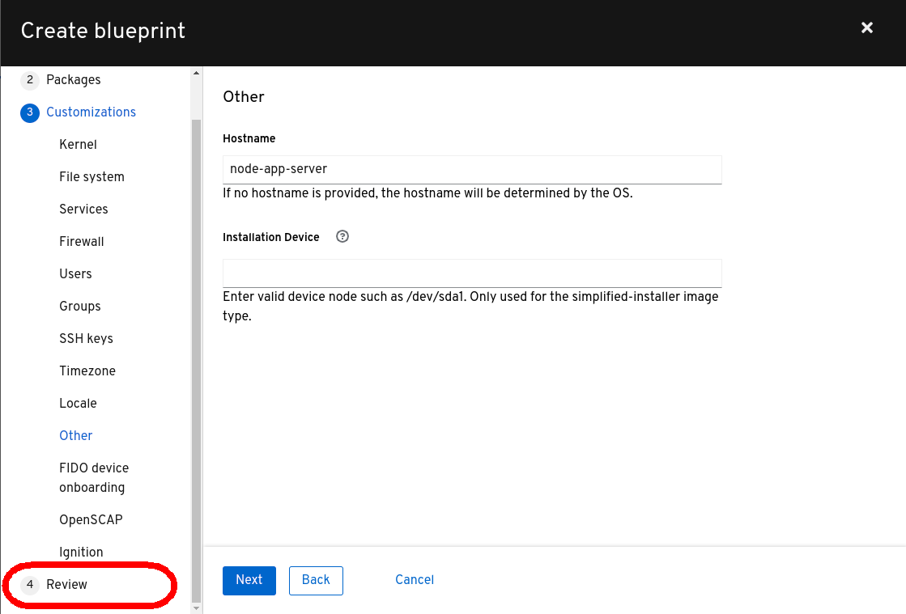
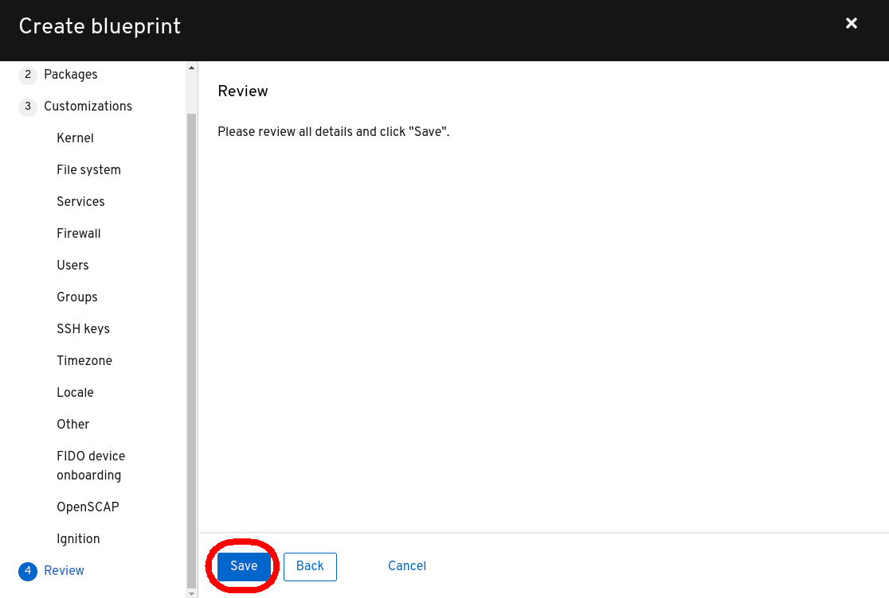

## Create a blueprint

Image Builder uses blueprints to create system images, however, none exist on this system  yet.

Select the *Create Blueprint* button to start building your first blueprint.

The first step to creating a new blueprint is naming it.  It is recommended that you also include a description so that others using this blueprint know what system image they are building.  For this lab, use __node-app-server__ as the *Name* and __A node.js and NGINX installed web application server__ as the *Description*.

Click `Next`.

Next we'll customize the blueprint.

Add in the first package, `nodejs`, into the `Available packages` search bar. Once the filter has been applied, you should now see packages with `nodejs` included in their name.

1) Click on `nodejs`.
2) Click the `>` symbol to add it.

Repeat these actions for the `nginx` package and then click `Next`.

Keep clicking the `Next` button until you reach the `Other` tab of the customizations section within the blueprint creation dialog. Then, enter a hostname `node-app-server` for the image.

Next, click `Review`

Finally, click `Save` to save the blueprint.
