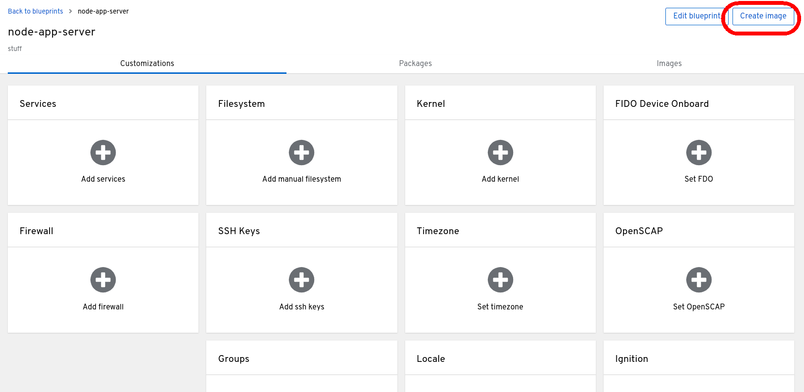
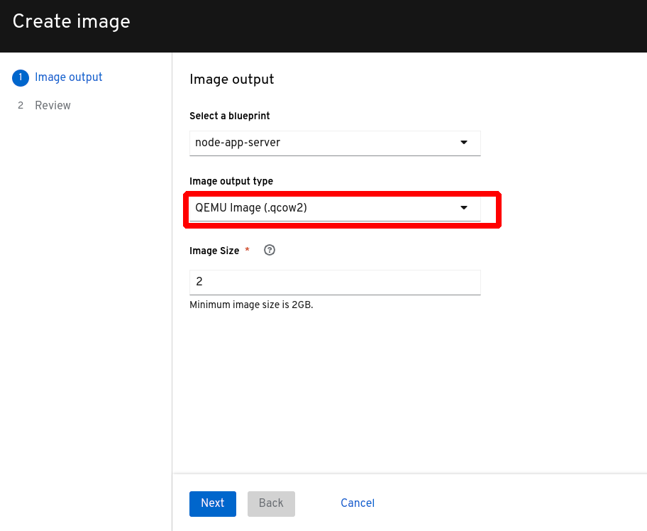
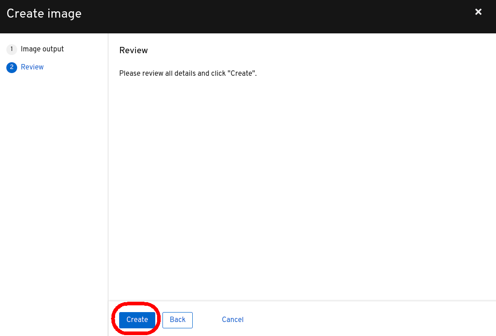
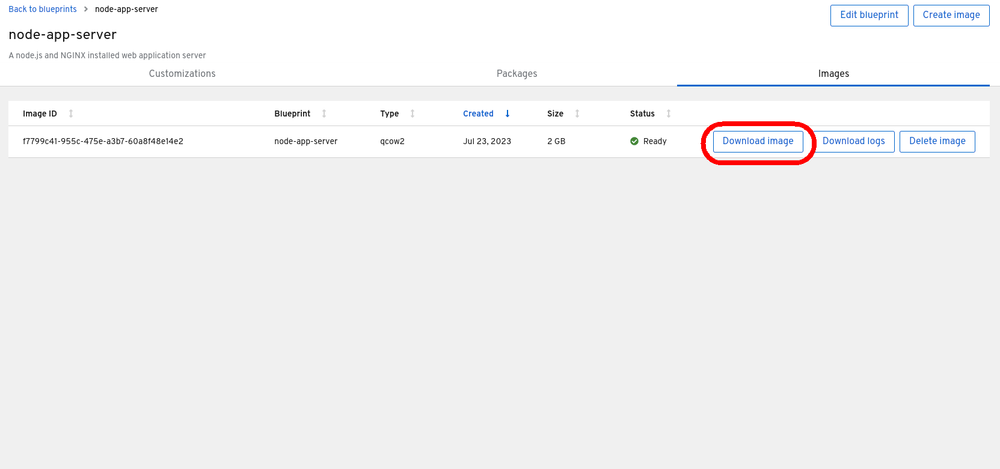

## Building an Image

You are now ready to build your first image of this new Red Hat Enterprise
Linux build with Node.js and NGINX packages installed.  Click the *Create image* button near the top of the interface.

The resulting dialog will ask several questions about how to build the image.
The first, and most important question is *Type*.  There are several different
output types supported by Image Builder:
* Amazon Web Services (.raw)
* OpenStack (.qcow2)
* QEMU Image (.qcow2)
* RHEL for Edge Commit (.tar)
* RHEL for Edge Container (.tar)
* RHEL for Edge Installer (.iso)
* Disk Archive (.tar)
* Microsoft Azure (.vhd)
* VMware VSphere (.vmdk)

For this lab, select the *Type* as __OpenStack (.qcow2)__ this makes a
virtual machine image that is compatible with the native virtualization
provided as part of Red Hat Enterprise Linux. However, you can see from the
list that you can make images for cloud providers or other virtualization
hypervisors.

Once you have specified the __OpenStack (.qcow2)__ as the *Type* select
the *Create* button to create an image of this output format.

Click `Next`.

You can review the image you've created in this menu. Click `Create`

To view the progress of the image build, click on the `Images` tab.

Click on `Images`.

Then you'll be taken to the status of the image build.

When the image build is complete, you can download the image by clicking on the kebab icon and `Download`.

That completes this lab.
