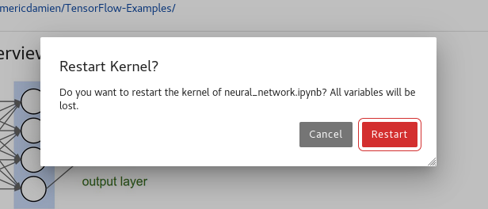

Click on the `Jupyter Notebook` tab near the top of the lab window. This will open your Jupyter Notebook in a new tab.

When presented with a login screen, enter `redhat` into the password box and click `Log in`.

When you reach the notebook's main menu, click on the check box to the left of `neural_network.ipynb`, and then click open.

First, take a look at the Jupyter Notebook. You'll notice that is structured as code surrounded by formatted text, offering context as to what the code is doing. In its current state, there is no visible output from your code. To view the output of your code, you will need to run the program.

To run all of the code, click on the button pictured below:

Next, you will be prompted with a dialog box asking whether you wish to restart the kernel. Click `Restart`.

The kernel will restart and your program will run. This will take about 20 seconds to finish.

Once the program has run, scroll to the bottom of the Jupyter Notebook to view the output of the program. Although the numbers will vary, you should notice a general trend. The loss is decreasing as the model goes through training. This indicates that the accuracy of the model is improving. The output should look something like this:
<pre class="file">
#1 Loss: 0.15329430997371674
#2 Loss: 0.11386959999799728
#3 Loss: 0.08571985363960266
#4 Loss: 0.0658247247338295
#5 Loss: 0.05170382186770439
#6 Loss: 0.04154754430055618
#7 Loss: 0.03411033749580383
#8 Loss: 0.02855597995221615
#9 Loss: 0.024325629696249962
#10 Loss: 0.021043190732598305
#11 Loss: 0.01845221407711506
#12 Loss: 0.0163748599588871
#13 Loss: 0.014685723930597305
#14 Loss: 0.013294734992086887
#15 Loss: 0.01213615108281374
#16 Loss: 0.011161181144416332
#17 Loss: 0.010333112441003323
#18 Loss: 0.009623898193240166
#19 Loss: 0.00901184044778347
#20 Loss: 0.00847998633980751
<< OUTPUT ABRIDGED >>
#80 Loss: 0.00332625606097281
#81 Loss: 0.0033161791507154703
#82 Loss: 0.003306429600343108
#83 Loss: 0.003297006944194436
#84 Loss: 0.003287883475422859
#85 Loss: 0.003279038006439805
#86 Loss: 0.003270472167059779
#87 Loss: 0.0032621577847748995
#88 Loss: 0.0032540960237383842
#89 Loss: 0.0032462747767567635
#90 Loss: 0.00323866936378181
#91 Loss: 0.003231281181797385
#92 Loss: 0.003224095096811652
#93 Loss: 0.003217114368453622
#94 Loss: 0.00321030686609447
#95 Loss: 0.003203692613169551
#96 Loss: 0.0031972324941307306
#97 Loss: 0.003190945601090789
#98 Loss: 0.003184819594025612
#99 Loss: 0.0031788365449756384
#100 Loss: 0.0031729976180940866
Predicted data based on trained weights:
Input (scaled): tensor([0.5000, 1.0000])
Output: tensor([0.9332])
</pre>

You have now successfully trained a neural network in Red Hat Enterprise Linux. This concludes the lab, but feel free to explore further until the lab session expires.
