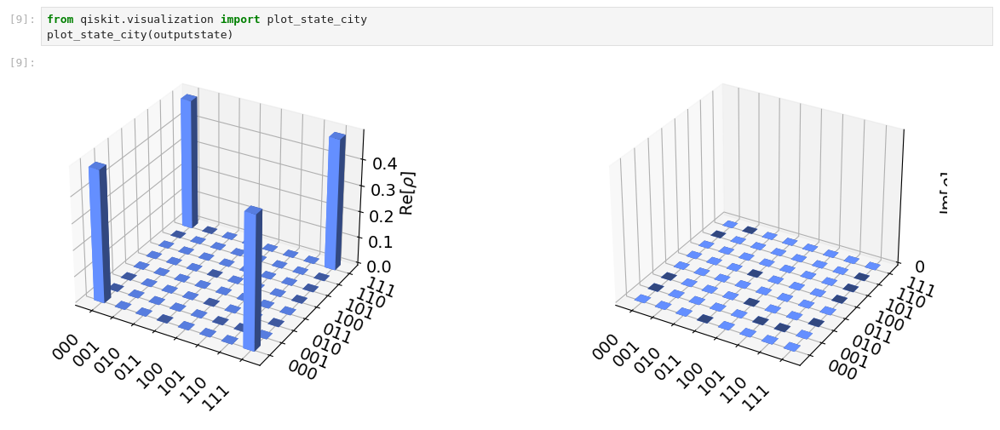
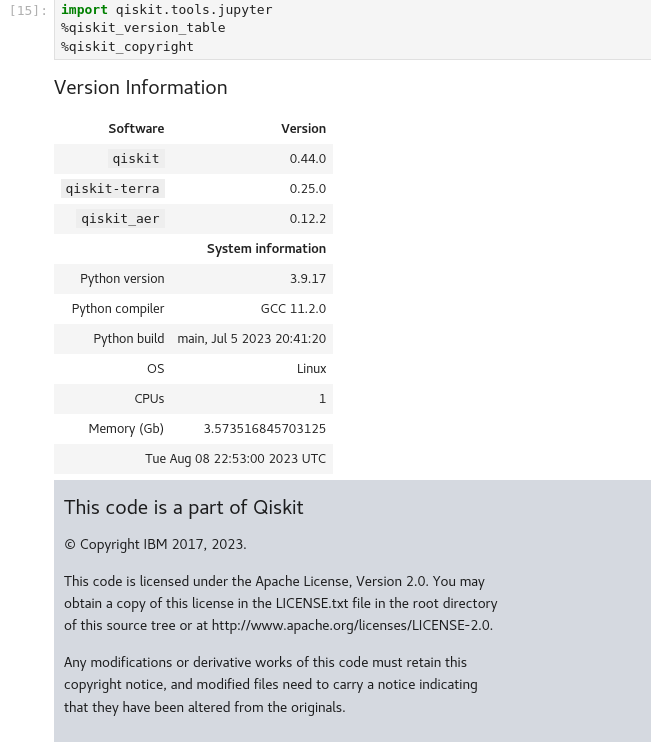

In this step, you will run a test program to demonstrate that your quantum simulation stack is functioning properly.

First, take a look at the Jupyter Notebook. You'll notice that is structured as code surrounded by formatted text, offering context as to what the code is doing. In its current state, there is no visible output from your code. To view the output of your code, you will need to run the program.

To run all of the code, click on the button pictured below:

Next, you will be prompted with a dialog box asking whether you wish to restart the kernel. Click `Restart`.

The kernel will restart and your program will run. This may take a few seconds to finish.

Once the program has run, scroll through your Jupyter Notebook again. It will have generated graphs like this:

If you scroll down to the bottom of your Jupyter Notebook, you will now see the virtual machine's system information, the current system time and a copyright notice.

You have now successfully configured and tested a quantum computing simulation stack. If you wish, you may continue to experiment with and modify the test program inside the Jupyter Notebook until the lab ends.

To learn more about quantum computing and Qiskit, check out this free course:
[https://qiskit.org/learn](https://qiskit.org/learn)
