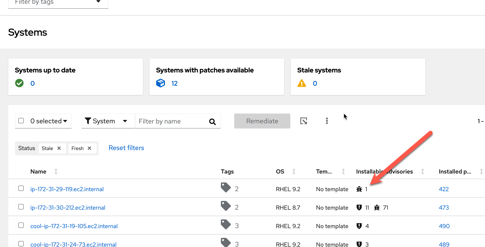
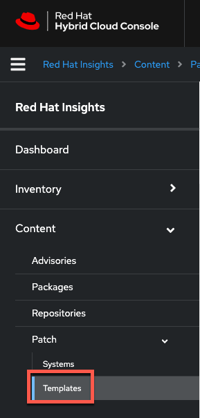
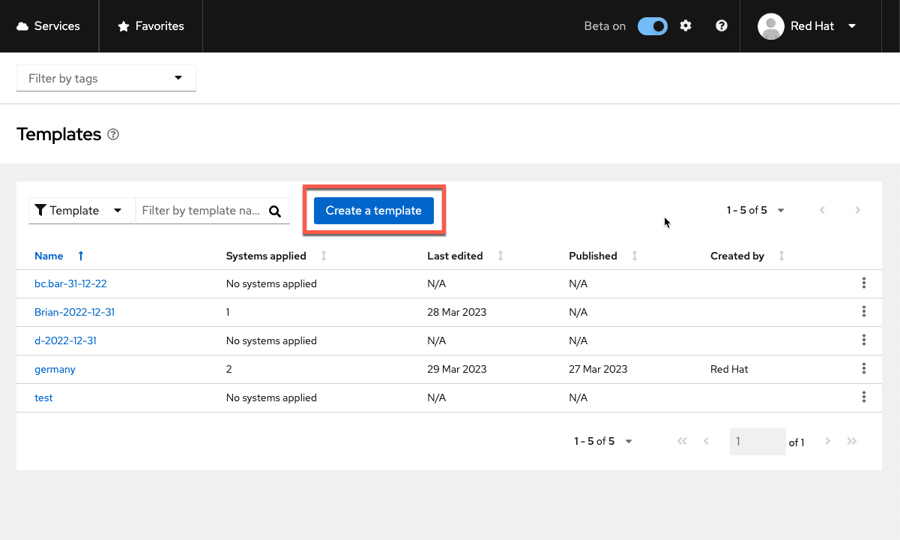
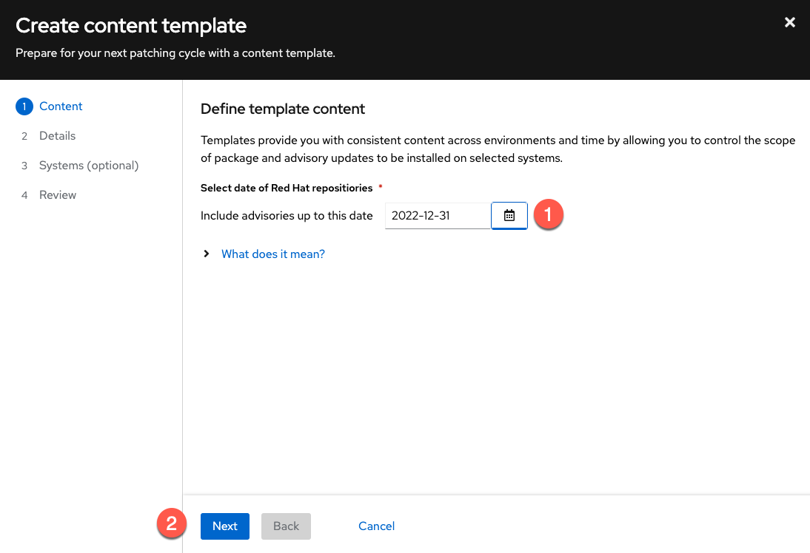
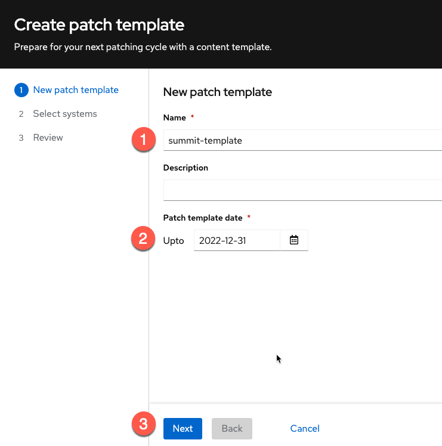
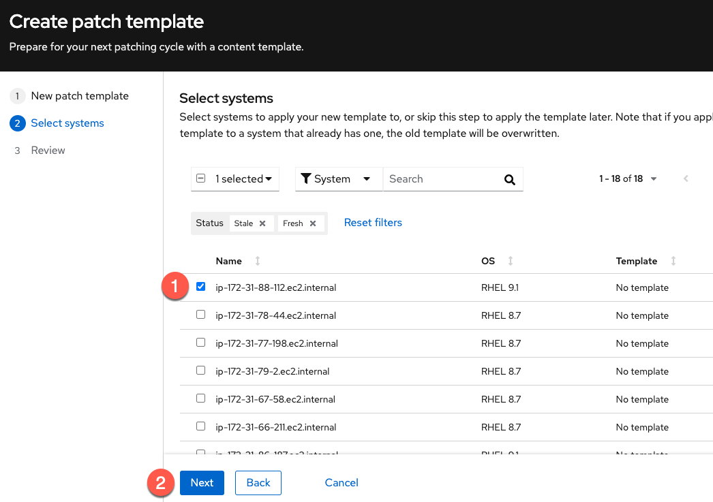
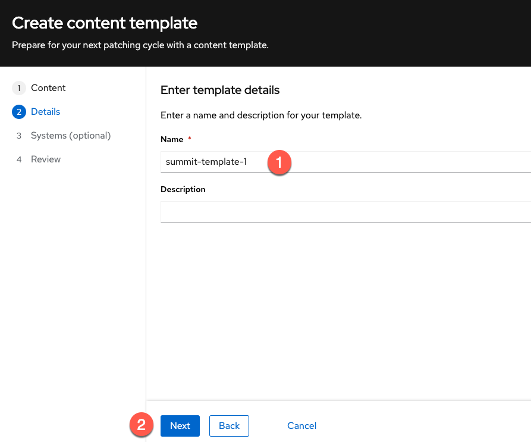
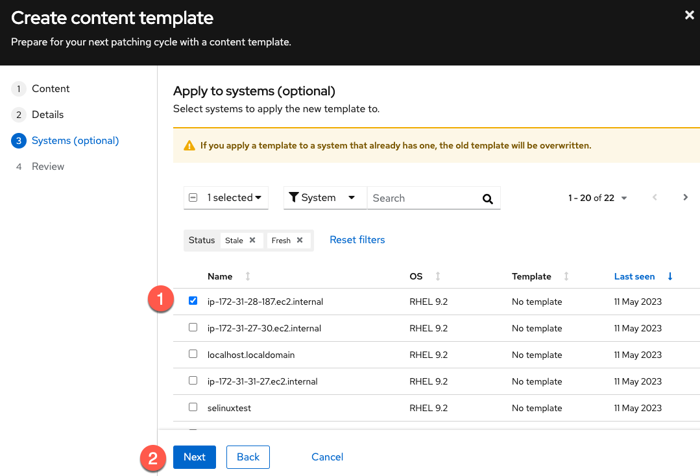
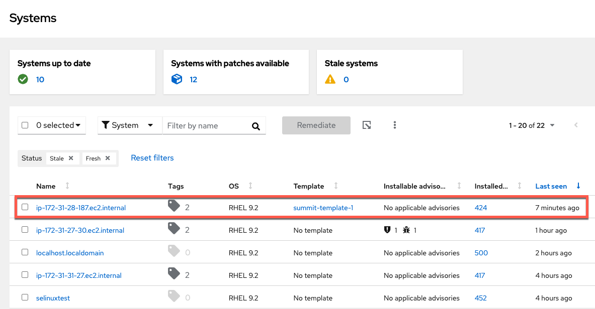

<!-- markdownlint-disable MD033 MD026-->

We will now patch our system with patches that were published up to December 31 by creating a patch template with a date of December 31, 2022.

First we'll downgrade `podman`. In the `Terminal`, run the following command.

```bash
dnf -y downgrade podman
```

Go to the Systems menu in the Patch application.


You'll see that the host has one installable advisory.



Go to the Patch template application.



Click the `Create a template` button.



Perform the following tasks in the `Create content template` menu.

1) Pick the date `2022-12-31`.
2) Click `Next`.


<!--
1) Give the template a name. In this example we'll name it `summit-template`.
2) Set the `Patch template date` to `2022-12-31`.
3) Click `Next`.

 -->

<!-- In the `Select systems` menu do the following.

1) Select the host you just launched in AWS.
2) Click `Next`.

 -->

Do the following in `Details`.

1) Give the template a name (please make it unique).
2) Click `Next`.



In the `Systems` menu, do the following.

1) Select the host you provisioned.
2) Click `Next`.



Click `Submit`.


Once the template has been created, go back to the System view in the Patch application.


Click on the system you applied the template to.



You'll find the patch is greyed out and cannot be applied to your system. This is because the podman advisory was published after the date we specified in the Patch template.
